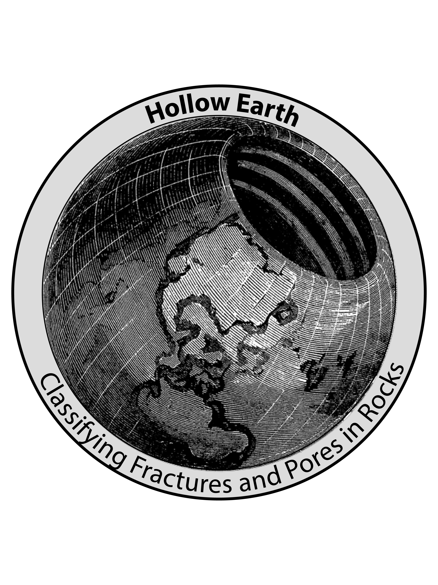

<div id="top"></div>
<!-- PROJECT SHIELDS -->
<!--
*** I'm using markdown "reference style" links for readability.
*** Reference links are enclosed in brackets [ ] instead of parentheses ( ).
*** See the bottom of this document for the declaration of the reference variables
*** for contributors-url, forks-url, etc. This is an optional, concise syntax you may use.
*** https://www.markdownguide.org/basic-syntax/#reference-style-links
-->

[![Contributors][contributors-shield]][contributors-url]

[![Stargazers][stars-shield]][stars-url]
[![Issues][issues-shield]][issues-url]
[![MIT License][license-shield]][license-url]

<!-- PROJECT LOGO -->
<br />
<div align="center">
  <a href="https://github.com/aaronlakeman/pore-type-segmentation-unet">
    
  </a>

<h3 align="center">Semantic Segmentation of Pores and Fractures in BiB-SEM Images</h3>

  <p align="center">
    This project was realized as the capstone project of the neuefische data science bootcamp.
    <br />
    <br />
    <br />
      <a href="https://github.com/aaronlakeman/pore-type-segmentation-unet/issues">Report Bug</a>
    ·
    <a href="https://github.com/aaronlakeman/pore-type-segmentation-unet/issues">Request Feature</a>
  </p>
</div>

<!-- TABLE OF CONTENTS -->
<details>
  <summary>Table of Contents</summary>
  <ol>
    <li>
      <a href="#about-the-project">About The Project</a>
      <ul>
        <li><a href="#built-with">Built With</a></li>
      </ul>
    </li>
    <li>
      <a href="#getting-started">Getting Started</a>
      <ul>
        <li><a href="#prerequisites">Prerequisites</a></li>
        <li><a href="#installation">Installation</a></li>
      </ul>
    </li>
    <li><a href="#usage">Usage</a></li>
    <li><a href="#contributing">Contributing</a></li>
    <li><a href="#license">License</a></li>
    <li><a href="#contact">Contact</a></li>
    <li><a href="#acknowledgments">Acknowledgments</a></li>
  </ol>
</details>

<!-- ABOUT THE PROJECT -->

## About The Project

Hollow Earth represents a machine learning based approach to identifying pores and fractures in SEM images of natural rocks. By using a modified U-Net architecture, it automatically segments and classifies images thereby accelerating the workflow and improving the results of this time-intensive task. This project is developed in cooperation with [MaP GmbH, Aachen](https://www.m-a-p.expert/).

The repository includes several notebooks demonstrating the applied workflow. Initial data screening (EDA-and-modeling.ipynb) and data preparation (preprocessing.ipynb) are followed by several semantic segmentation approaches. These include a basic U-Net model (Semantic_Segmentation.ipynb), an attentionres U-Net model (attnresunet_colab.ipynb) and a U-Net model which substitutes the U-Net encoder with a pretrained net (pretrained_semantic_segmentation.ipynb). Finally, trained models can be utilized to segment and label unseen data (predict.ipynb).

<p align="right">(<a href="#top">back to top</a>)</p>

### Built With

- [Tensorflow](https://www.tensorflow.org/)
- [Keras](https://keras.io/)
- [OpenCV](https://opencv.org/)
-

<p align="right">(<a href="#top">back to top</a>)</p>

<!-- GETTING STARTED -->

## Getting Started

This is an example of how you may give instructions on setting up your project locally.
To get a local copy up and running follow these simple example steps.

### Installation

Use the requirements file in this repo to create a new environment.

```BASH
make setup
```

or

```BASH
pyenv local 3.9.8
python -m venv .venv
source .venv/bin/activate
pip install --upgrade pip
pip install -r requirements.txt
```

<p align="right">(<a href="#top">back to top</a>)</p>

<!-- USAGE EXAMPLES -->

## Usage

This is a placeholder for

_For more examples, please refer to the [Documentation](https://example.com)_

<p align="right">(<a href="#top">back to top</a>)</p>

<!-- CONTRIBUTING -->

## Contributing

Contributions are what make the open source community such an amazing place to learn, inspire, and create. Any contributions you make are **greatly appreciated**.

If you have a suggestion that would make this better, please fork the repo and create a pull request. You can also simply open an issue with the tag "enhancement".
Don't forget to give the project a star! Thanks again!

1. Fork the Project
2. Create your Feature Branch (`git checkout -b feature/AmazingFeature`)
3. Commit your Changes (`git commit -m 'Add some AmazingFeature'`)
4. Push to the Branch (`git push origin feature/AmazingFeature`)
5. Open a Pull Request

<p align="right">(<a href="#top">back to top</a>)</p>

<!-- LICENSE -->

## License

Distributed under the MIT License. See `LICENSE` for more information.

<p align="right">(<a href="#top">back to top</a>)</p>

<!-- CONTACT -->

## Contact

Maximilian Hallenberger - max.hallenberger [@] gmail [dot] com

Aaron Teichmann - aaron.teichmann [@] gmail [dot] com

Project Link: [https://github.com/aaronlakeman/pore-type-segmentation-unet](https://github.com/aaronlakeman/pore-type-segmentation-unet)

<p align="right">(<a href="#top">back to top</a>)</p>

<!-- ACKNOWLEDGMENTS -->

<p align="right">(<a href="#top">back to top</a>)</p>

<!-- MARKDOWN LINKS & IMAGES -->
<!-- https://www.markdownguide.org/basic-syntax/#reference-style-links -->

[contributors-shield]: https://img.shields.io/github/contributors/github_username/repo_name.svg?style=for-the-badge
[contributors-url]: https://github.com/aaronlakeman/pore-type-segmentation-unet/graphs/contributors
[forks-shield]: https://img.shields.io/github/forks/github_username/repo_name.svg?style=for-the-badge
[forks-url]: hhttps://github.com/aaronlakeman/pore-type-segmentation-unet/network/members
[stars-shield]: https://img.shields.io/github/stars/github_username/repo_name.svg?style=for-the-badge
[stars-url]: https://github.com/aaronlakeman/pore-type-segmentation-unet/stargazers
[issues-shield]: https://img.shields.io/github/issues/github_username/repo_name.svg?style=for-the-badge
[issues-url]: https://github.com/aaronlakeman/pore-type-segmentation-unet/issues
[license-shield]: https://img.shields.io/github/license/github_username/repo_name.svg?style=for-the-badge
[license-url]: https://github.com/aaronlakeman/pore-type-segmentation-unet/blob/master/LICENSE.txt
[linkedin-shield]: https://img.shields.io/badge/-LinkedIn-black.svg?style=for-the-badge&logo=linkedin&colorB=555
[linkedin-url]: https://linkedin.com/in/linkedin_username
[product-screenshot]: images/screenshot.png
